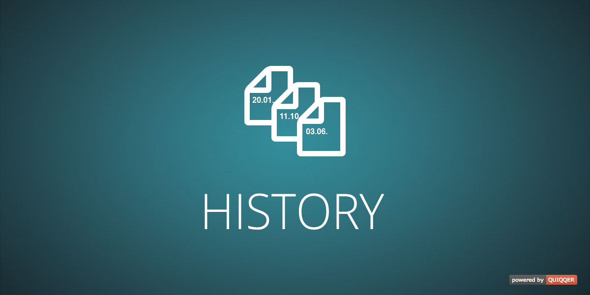

# QUIQQER History

The History module stores versions of changes to QUIQQER sites and bricks. Administrators can preview, compare, and
restore earlier versions.

Package name: `quiqqer/history`

## Features

- Stores older versions of pages & bricks
- Compare different versions of pages & bricks
- Restore old versions of pages & bricks

## Installation

Install the package through Composer:

```bash
composer require quiqqer/history
```

Run the QUIQQER setup afterward so the package configuration and project history tables are imported:

```bash
./console setup
```

## Configuration

Open the project settings and select **History**. The limits define how many versions are retained for each site and
brick. Set a limit to `0` to retain all versions.

## Usage

The site editor and brick editor provide a **History** tab. Select one version to preview or restore it, or select two
versions to compare their content.

To create an initial entry for existing sites and bricks, run:

```bash
./console history:initialize
```

## Development

Initialize the package-local development tools and run the complete quality suite with:

```bash
composer dev:init
composer test
```

## Contribute

- Project: https://dev.quiqqer.com/quiqqer/history
- Issue Tracker: https://dev.quiqqer.com/quiqqer/history/issues
- Source Code: https://dev.quiqqer.com/quiqqer/history

## Support

If you found any flaws, have any wishes or suggestions, you can send an email
to [support@pcsg.de](mailto:support@pcsg.de) to inform us about your concerns.
We will try to respond to your request and forward it to the responsible developer.

## License

- PCSG QL-1.0
- CC BY-NC-SA 4.0
